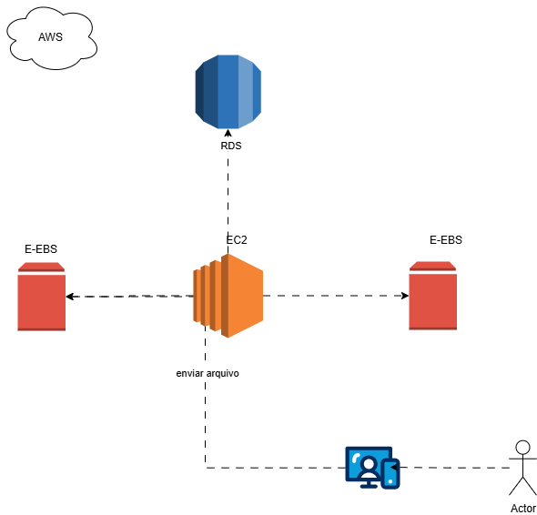
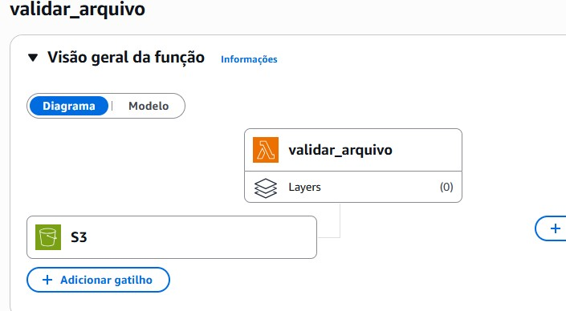
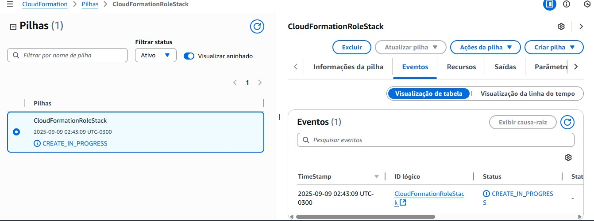
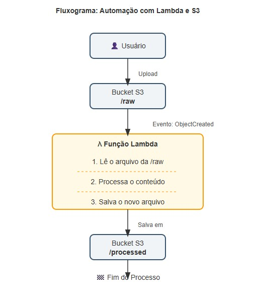
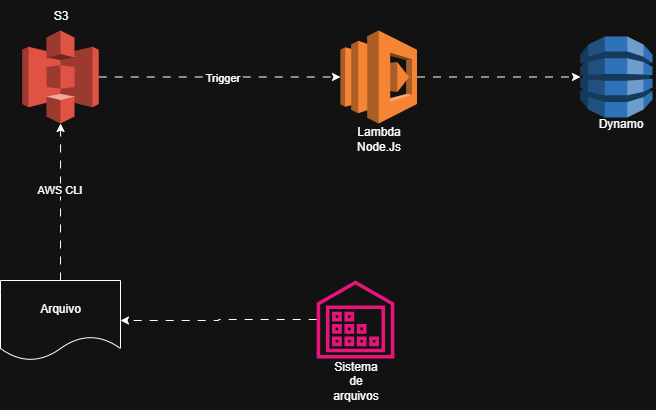

Projeto de Automação Serverless e Infraestrutura como Código na AWS

1. Resumo do Projeto
Este repositório reúne os projetos desenvolvidos como parte do Bootcamp Santander Code Girls + DIO, com foco em automação e gerenciamento de infraestrutura na nuvem AWS.

Automação Serverless (Lambda + S3): Demonstra a criação de uma pipeline event-driven que monitora um bucket S3 e processa arquivos de texto automaticamente usando AWS Lambda.

Automação de Infraestrutura (CloudFormation): Apresenta o uso de Infraestrutura como Código (IaC) para provisionar e gerenciar recursos AWS (EC2, S3, VPC, IAM) de forma declarativa através de templates.

O objetivo é consolidar o aprendizado em computação em nuvem, arquitetura serverless e IaC, criando soluções automatizadas, seguras, escaláveis e versionáveis.

2. Objetivos de Aprendizagem
Aplicar conceitos fundamentais da AWS em ambientes práticos e projetos reais.

Documentar processos técnicos de forma clara e estruturada para portfólio.

Utilizar o GitHub como ferramenta para compartilhamento de conhecimento técnico.

Desenvolver habilidades práticas em automação de infraestrutura e arquitetura serverless.

3. Projeto 1 – Automação Serverless: Lambda + S3

3.1 Arquitetura da Solução
A arquitetura é event-driven (orientada a eventos): o S3 dispara um evento de criação de objeto, que por sua vez aciona a função Lambda para processar o arquivo.

graph TD
    subgraph "Ambiente AWS"
        A[👤 Usuário] -- Upload do 'arquivo.txt' --> B(🪣 Bucket S3);
        
        subgraph "Bucket S3"
            direction LR
            B_RAW[/raw/]
            B_PROC[/processed/]
        end

        B -- Evento 's3:ObjectCreated:*' --> C((λ Função Lambda));
        
        subgraph "Execução Lambda"
            direction TB
            C_READ[Ler arquivo]
            C_PROC[Processar conteúdo → Maiúsculas]
            C_WRITE[Salvar arquivo processado]
        end

        C --> C_READ --> C_PROC --> C_WRITE;
        C_WRITE -- Salva em --> B_PROC;
    end
    
    B_PROC --> F[FIM: Arquivo processado disponível];

3.2 Tecnologias Utilizadas
Amazon S3: Para armazenamento de objetos de entrada e saída.

AWS Lambda: Para execução do código de processamento de forma serverless.

IAM: Para gerenciamento de permissões específicas para a função Lambda.

CloudWatch: Para monitoramento de métricas e logging da execução.

Python 3.9 + Boto3: Para a lógica da função.

3.3 Código da Função Lambda
import boto3
import urllib.parse
import logging

logger = logging.getLogger()
logger.setLevel(logging.INFO)

s3_client = boto3.client('s3')

def lambda_handler(event, context):
    try:
        bucket_name = event['Records'][0]['s3']['bucket']['name']
        object_key = urllib.parse.unquote_plus(
            event['Records'][0]['s3']['object']['key'], encoding='utf-8'
        )

        logger.info(f"Evento recebido: bucket={bucket_name}, objeto={object_key}")

        if not object_key.startswith('raw/'):
            logger.warning("Objeto fora da pasta raw/. Ignorando.")
            return

        response = s3_client.get_object(Bucket=bucket_name, Key=object_key)
        file_content = response['Body'].read().decode('utf-8')
        processed_content = file_content.upper()
        processed_key = object_key.replace('raw/', 'processed/')

        s3_client.put_object(
            Bucket=bucket_name,
            Key=processed_key,
            Body=processed_content,
            ContentType='text/plain'
        )

        logger.info(f"Processado e salvo em {processed_key}")
        return {'statusCode': 200, 'body': f"Arquivo '{object_key}' processado com sucesso!"}

    except Exception as e:
        logger.error(f"Erro: {e}")
        raise e

3.4 Resultados e Validação
Após enviar um arquivo para a pasta /raw, a função Lambda é acionada automaticamente.

O arquivo processado (com texto em maiúsculas) aparece na pasta /processed.

Os logs no CloudWatch confirmam a execução correta e fornecem detalhes para depuração.

(Adicione seus prints na pasta /images e referencie-os aqui)

4. Projeto 2 – Automação de Infraestrutura: CloudFormation
4.1 Descrição
Este projeto foca na criação de stacks de infraestrutura via templates declarativos em YAML, aplicando as melhores práticas de Infraestrutura como Código (IaC). Os templates provisionam recursos como EC2, S3, VPCs e IAM Roles.

4.2 Arquitetura de Exemplo
O diagrama abaixo ilustra uma arquitetura de rede básica que pode ser provisionada com CloudFormation.

graph LR
    VPC[VPC Principal] --> Subnet1[Subnet Pública];
    VPC --> Subnet2[Subnet Privada];
    Subnet1 --> EC2[Instância EC2];
    Subnet2 --> Lambda[Função Lambda];
    S3[Bucket S3] --> Lambda;

4.3 Estrutura de Templates
templates/ec2.yaml: Template para criação de instâncias EC2.

templates/s3.yaml: Template para buckets S3 com políticas e versionamento.

templates/network.yaml: Template para VPC, subnets e security groups.

5. Desafios e Aprendizados
IAM: A configuração correta de permissões granulares é crucial e um dos principais pontos de atenção.

Serverless: Compreender a natureza stateless das funções Lambda e a importância do monitoramento via CloudWatch.

IaC: O poder de versionar e replicar infraestruturas inteiras de forma consistente e automática com CloudFormation.

Documentação: A habilidade de documentar claramente uma arquitetura é tão importante quanto implementá-la.

6. Sobre o Bootcamp Santander Code Girls + DIO
Trilha de 40h focada na certificação AWS Cloud Practitioner (CLF-C02).

Oferece voucher para o exame de certificação para os melhores alunos.

Inclui mentorias ao vivo, desafios de código e projetos práticos para portfólio.

Ambiente gamificado e oportunidades de contratação pela F1RST.

7. Autor
👩‍💻 Tatiana Kami

